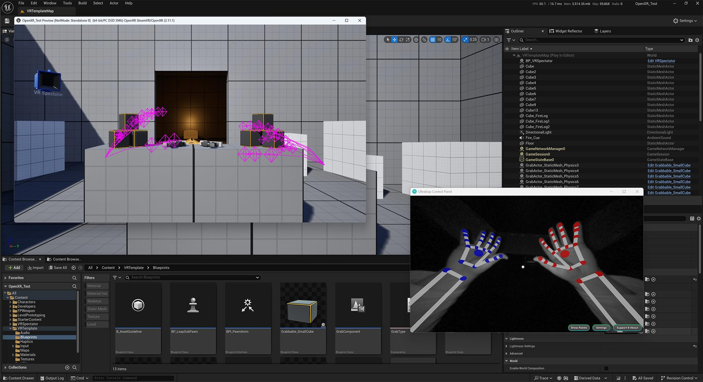

# OpenXR Hand Transform Offset Layer

A simple OpenXR Layer to add an offset to Hand Tracking data built using the
excellent OpenXR Layer Template from Ybalrid:

https://github.com/Ybalrid/OpenXR-API-Layer-Template

This was created specifically to allow quicker iteration when developing hand-tracking 
features for VR experiences without needing to continually have the headset on.

In our use case, we use a Leap Motion Controller 2 placed on the Desktop with
OpenXR mode enabled, but we want to emulate the hand position within Unreal Engine
at the OpenXR layer without using some middleware in-engine, or even having to use
the Ultraleap Plugin.

For my day-to-day game testing, I use the SteamVR runtime without a headset present. UltraLeap adds support for hand tracking with its API layer, and we intercept `xrLocateHandJointsEXT` to rotate everything.

### Ultraleap Hand Tracking OpenXR Mode Patch

**Note:** It was necessary to patch the `UltraleapHandTracking.dll` to prevent it
from continually switching to 'VR Mode' when OpenXR was enabled, otherwise the
tracking performance is affected (as it assumes a HMD mount). I have contacted
Ultraleap support to see if there is a hidden configuration value to prevent this,
but regardless, it is a simple patch to make in Ghidra.



## Usage

Ensure OpenXR-SDK submodule is initialized:  
```cmd
git submodule update --init
```

Build the layer

```cmd
mkdir build
cd build
cmake ..
cmake --build .
```

Add the layer, which is easiest done using https://github.com/fredemmott/OpenXR-API-Layers-GUI  
Click 'Add Layers', navigate to the manifest file at `./build/XR_APILAYER_STASIS_hand_tracking_transform/manifest.json`  
The layer must appear before `UltraleapHandTracking.json` in order to work.

Copy `hand_transform_config.txt` somewhere (maybe your project directory) and set the environment variable `HAND_TRACKING_CONFIG_PATH` to the absolute path. This is the only way to update the config
at runtime.

### Example launching an OpenXR test project directly into VR mode:

```cmd
set HAND_TRACKING_CONFIG_PATH=E:\Epic\Projects\5_5\OpenXR_Test\hand_transform_config.txt
e:\Epic\UE_5.5\Engine\Binaries\Win64\UnrealEditor.exe %cd%\OpenXR_Test.uproject -game
```